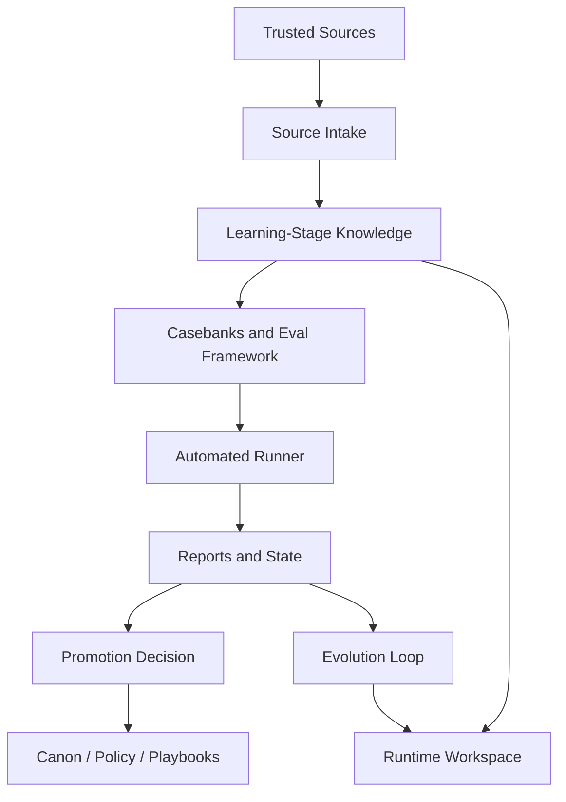

# Architecture

## Goal

Build a training pipeline that improves an agent's behavior through:

- better knowledge intake
- stronger evaluation
- clearer promotion rules
- optional runtime evolution

The target is behavior improvement, not model-weight training.

## Main Layers

### 1. Source Intake Layer

This layer defines:

- what sources are allowed
- freshness requirements
- official-vs-secondary priority
- how raw evidence is logged

Typical artifacts:

- source register
- intake policy
- scrape or fetch logs

### 2. Distilled Knowledge Layer

This layer turns raw source intake into reusable operating knowledge:

- curriculum
- briefs
- bodies of knowledge
- diagnostic anchors
- playbooks

This layer is allowed to be broad and learning-stage.

### 3. Eval Layer

This layer determines whether the agent is actually improving:

- eval framework
- casebanks
- registries
- runner
- reports

Without this layer, "training" is mostly vibes.

### 4. Runtime Layer

This is the layer the agent uses while answering:

- system prompt
- skills
- memory
- tool registry

This layer should be allowed to evolve, but not to rewrite canon casually.

### 5. Promotion Layer

This layer defines what may become stable truth:

- canon
- policy
- approved playbooks

Promotion should require evidence, not intuition.

## Data Flow

## Immutable vs Mutable

Keep these mostly immutable:

- canon
- policy
- approval rules
- critical safety boundaries

Keep these mutable under gating:

- system prompt
- domain skills
- memory summaries
- task routing hints
- read-only tool selection hints

## Why This Separation Matters

If you merge all layers together:

- the agent can hallucinate doctrine
- regressions become invisible
- temporary workarounds look like permanent truth
- evaluation becomes impossible to interpret

