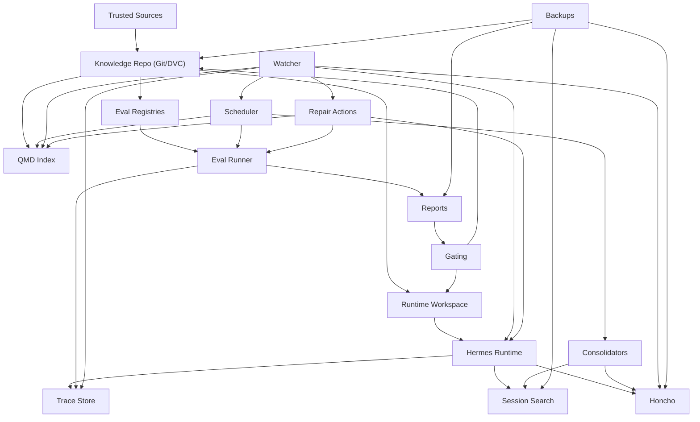

# Infrastructure Blueprint

## Goal

Design a local-first training and improvement stack for agents that:

- learn from a versioned knowledge body
- improve through eval evidence
- preserve relational continuity
- stay auditable and recoverable
- degrade safely when parts of the stack fail

This blueprint assumes the runtime agent is separate from the training and
operations stack.

## Core Design Rule

Do not treat "memory" as one thing.

Split the stack into:

1. source-of-truth knowledge
2. retrieval infrastructure
3. relational memory
4. episodic decision memory
5. runtime workspace
6. eval and trace evidence
7. backup and recovery

## Recommended Local-First Stack

### 1. Knowledge and Artifact Truth

- `git` repo for all canonical and learning-stage files
- optional `DVC` for heavier datasets, snapshots, and eval artifacts
- markdown, yaml, and json as primary portable formats

This layer is the transferable knowledge pack.

### 2. Retrieval Layer

- `QMD` as the local search sidecar
- indexes knowledge files, eval reports, notes, and approved session exports
- exposes CLI, MCP, or HTTP

This layer answers: "what should the agent read right now?"

### 3. Relational Memory Layer

- `Honcho` or an equivalent local relational memory service
- stores user preferences, ongoing collaborations, durable project facts, and
  relationship continuity

This layer answers: "who is this user and how do we usually work together?"

### 4. Episodic Memory Layer

- `session_search` or an equivalent searchable session archive
- stores decisions, rationale, experiment history, and prior troubleshooting

This layer answers: "what happened before, and why?"

### 5. Runtime Workspace Layer

- mutable prompts
- mutable skills
- compact memory summaries
- tool registry and routing hints

This layer is allowed to evolve under gating.

### 6. Eval and Trace Layer

- eval runner
- suite registry
- report store
- trace store such as `Langfuse`

This layer answers: "did behavior improve, and what evidence supports it?"

### 7. Backup and Recovery Layer

- `restic` for encrypted snapshots
- `syncthing` for machine-to-machine sync when needed
- optional SQLite replication if the local runtime depends on SQLite heavily

This layer answers: "can we restore the agent and its knowledge cleanly?"

## Service Topology

## Storage Ownership

### Knowledge Repo

Stores:

- canon
- policy
- playbooks
- learning-stage knowledge
- eval registries
- operational runbooks

Must not store:

- raw conversational relationship notes
- noisy temporary session debris
- opaque memory dumps

### QMD

Stores or indexes:

- searchable chunks from approved knowledge and evidence
- semantic vectors and BM25 indexes
- collection metadata

Must not become the only source of truth.

### Honcho

Stores:

- durable user preferences
- collaboration style
- recurring priorities
- relationship continuity

Must not become the main paid-media doctrine store.

### Session Search

Stores:

- decisions
- reasoning chains worth preserving
- experiment history
- troubleshooting history

Must not be promoted directly into canon.

### Runtime Workspace

Stores:

- prompt variants
- skills under evaluation
- short memory summaries
- tool routing hints

Must stay rollback-friendly.

## Relational Data Flows

### Flow A: Domain Truth

`trusted source -> intake log -> distilled file -> eval -> promotion -> canon`

Primary home:

- knowledge repo

### Flow B: Relational Continuity

`conversation -> extracted preference/fact -> review filter -> Honcho`

Primary home:

- relational memory

### Flow C: Episodic Recall

`session -> summary/rationale -> session archive -> searchable recall`

Primary home:

- session search

### Flow D: Runtime Improvement

`failed eval -> patch candidate -> canary run -> promote or rollback`

Primary home:

- runtime workspace

### Flow E: Transfer and Backup

`knowledge repo + runtime snapshot + memory export + reports -> portable bundle`

Primary home:

- backup and export layer

## LLM Dependency Map

### Does not require an LLM

- git and DVC versioning
- backups and sync
- raw file storage
- BM25 search
- deterministic scorers
- cron or service scheduling
- health probes
- service restart logic

### Requires an LLM or model-like component

- runtime reasoning
- semantic embeddings
- reranking if neural
- memory summarization
- preference extraction from sessions
- judge-based eval scoring
- automated patch proposal for prompts or skills

### Strong Recommendation

Keep retrieval and memory infrastructure usable without the main reasoning
model. The agent should lose quality under degraded mode, not all function.

## Minimum Viable Deployment

Use this when starting local and small:

- knowledge repo: `git`
- retrieval: `QMD`
- relational memory: existing local `Honcho`
- episodic memory: existing `session_search`
- runtime: `Hermes`
- traces: local trace store or file logs
- backups: `restic`
- model services: one local embeddings/rerank service plus one reasoning model

## Full Training Deployment

Add these when the pipeline becomes repeatable:

- `DVC` for datasets and eval artifacts
- `Langfuse` for traces and reviewable runs
- dedicated local embedding and rerank service
- scheduler with named jobs
- watcher with auto-remediation
- export bundles for cross-machine restore

## Non-Negotiable Safety Boundaries

- runtime mutation must never rewrite canon directly
- watcher actions must be idempotent where possible
- repair scripts must be allowlisted
- restores must be tested, not only backed up
- degraded mode must prefer read-only operation over silent corruption
