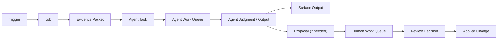

# Runtime Orchestration Objects

## Goal

Define the runtime objects that connect:
- system signals
- scheduled jobs
- agent work
- human review
- applied change

This document is product-agnostic.

## Core rule

- the software owns time
- the agent owns judgment

The scheduler, triggers, and jobs decide when work starts.
The agent interprets the work it receives.

## Object model

### Trigger

A trigger says work should be considered.

Examples:
- recurring schedule
- human request
- state transition
- telemetry threshold
- connector drift

### Job

A job is deterministic system work that evaluates a trigger.

Examples:
- drift review
- freshness audit
- weekly summary
- threshold detector

Rule:
- a job may gather evidence
- a job should not invent agent judgment

### Agent task

An agent task is work routed to the agent.

It should include:
- task type
- reason
- payload
- related entities
- expected output object or surface
- status

Suggested statuses:
- `pending`
- `in_progress`
- `blocked`
- `completed`
- `cancelled`

### Agent work queue

This queue holds agent tasks.

It exists so the system can see:
- what has been assigned
- what is running
- what is blocked
- what completed

Rule:
- do not confuse agent work queue with human approval

### Surface output

Surface output is the result the agent writes back into the product.

Examples:
- recommendation
- review summary
- structured sections
- timeline entry
- canonical update

### Recommendation

A recommendation is advice or judgment.

It may be:
- informational
- advisory
- actionable

Rule:
- a recommendation is not yet a committed change

### Proposal

A proposal is a reviewable object with explicit approval semantics.

Use a proposal when:
- human approval is required
- governance matters
- the change is high-impact
- the result must be audited

### Human work queue

This queue holds proposals or decisions that need human review.

Rule:
- not every recommendation should appear here
- only proposals or review-required items belong here

### Applied change

An applied change is the committed mutation of:
- canonical state
- external execution
- or both

It should be traceable back to:
- a task
- a recommendation
- a proposal
- a review decision

## Canonical runtime flow

## Design rules

### 1. Keep objects distinct

Do not collapse:
- task
- recommendation
- proposal
- applied change

If these blur together, the runtime becomes hard to audit and hard to train.

### 2. Keep queues distinct

Use at least two queues when needed:
- agent work queue
- human work queue

They solve different problems.

### 3. Keep the job deterministic

The job should:
- gather evidence
- create tasks
- update factual runtime state

The job should not:
- pretend to be the agent
- write strategic rationale
- silently commit judgment-heavy change

### 4. Make approval boundaries explicit

If a human decision is required:
- produce a proposal
- route it to human work queue
- wait for the review outcome

### 5. Preserve lineage

Every applied change should be able to answer:
- what triggered this
- which task processed it
- what did the agent recommend
- what did the human approve

## Good implementation order

1. define triggers
2. define jobs
3. define task schema
4. define agent work queue
5. define output surfaces
6. define proposal schema
7. define human work queue
8. define applied-change handlers

