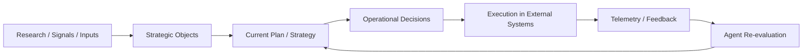
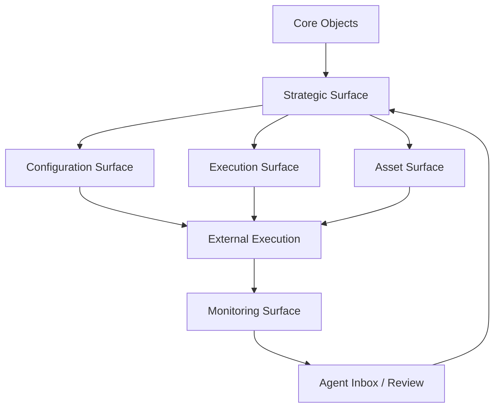

# Agent-Platform Operating Protocol

Last updated: 2026-04-01

## Purpose

This document defines a conceptual and technical framework for building software that:
- has a human-facing interface
- has an agent that thinks and operates
- connects to external systems
- evolves through decisions, changes, and feedback

Short name:
- `APOP`

It is product-agnostic and agent-agnostic.

It can be used as a foundation for:
- architecture
- product design
- agent training protocol
- surface design
- source-of-truth alignment

## Core idea

In an agent-native system:
- the software is not just UI
- the agent is not just chat
- the integrations are not just APIs

The complete system works like this:
- `agent` = decision engine
- `software` = operating system + source of truth
- `external systems` = execution layer
- `telemetry` = feedback loop

## Foundational rule

- the agent should not write screens
- the agent should write:
  - canonical state
  - canonical messages
  - canonical changes
- the UI should render from that state

That implies:
- surfaces are not isolated forms
- surfaces are derived views of a shared model

## System layers

### 1. Domain layer

This is the business layer.

It defines:
- entities
- relationships
- rules
- semantics

Generic examples:
- records
- workflows
- plans
- assets
- configurations
- approvals
- execution state

### 2. Canonical state layer

This is the structured source of truth.

It should contain:
- current state
- relevant history
- active configurations
- agent messages
- derived events
- references to external execution

Rule:
- if a surface matters, it should be derivable from this layer

### 3. Surface layer

These are the views where humans and agents read the system.

Examples:
- tabs
- cards
- tables
- timelines
- inboxes
- dashboards

Rule:
- a surface is not the truth
- a surface is a reading of the system

### 4. Agent protocol layer

This layer defines:
- what the agent can write
- what it owns
- how it classifies content
- where it communicates
- what it does not own

This usually lives in:
- surface docs
- contracts
- schemas
- training rules

### 5. Connector / execution layer

This layer translates canonical state into real actions in external systems.

Examples:
- writing to APIs
- triggering jobs
- syncing states
- reading external outcomes
- recording drift, retries, errors, and completions

## Decision flow

The idea:
- a conceptual base feeds decisions
- those decisions become operational configuration
- the system executes
- feedback returns
- the agent re-evaluates

## Surface dependency graph

This describes:
- dependency between surfaces
- sequencing of decisions
- the correct reasoning order for the agent

## Surface types

### 1. Snapshot surfaces

They answer:
- what is happening now

They contain:
- metrics
- status
- counts
- benchmarks
- confidence

### 2. Strategic surfaces

They answer:
- what does this mean
- why does this exist
- what should happen next

They contain:
- thesis
- goals
- rationale
- guidance
- risks

### 3. Configuration surfaces

They answer:
- how is the system or workflow currently configured

They contain:
- settings
- parameters
- defaults
- deviations
- platform-specific details

### 4. Execution surfaces

They answer:
- what happened operationally

They contain:
- run state
- sync state
- errors
- retries
- external status
- logs

### 5. Agent inbox surfaces

They answer:
- what does the agent want to communicate

They contain:
- notes
- observations
- recommendations
- risks
- next steps

## Ownership model

### What the agent should write

- rationale
- guidance
- strategic messages
- recommendations
- authored labels that depend on judgment
- strategic timeline events
- classification of content into sections

### What the agent should not write

- IDs
- factual timestamps
- raw metrics
- connector state when it is only factual
- technical execution logs
- factual configuration when it is shown only as a fact

### Simple rule

- if something interprets, justifies, or recommends: it probably belongs to the agent
- if something measures, records, or syncs: it probably does not

## What the software must contain

### 1. Canonical entities

The system needs clear objects.

Generic examples:
- plan
- configuration
- asset
- message
- event
- state
- execution record

### 2. Surface contracts

Each important surface needs an explicit contract:
- what it shows
- where it comes from
- who owns it
- what fallback exists
- what the agent can write

### 3. Change protocols

Changes should not live only as UI text.

They should exist as real objects:
- what changed
- who changed it
- when
- what it impacts
- which surfaces should reflect it

### 4. Timelines

If part of the system changes over time:
- it should be able to have a timeline

Not for everything.
Only for things that evolve and change decisions.

### 5. Fallback buckets

The UI should not block the agent when new content appears.

It is usually helpful to have fallback sections like:
- additional signals
- additional settings
- other notes

Rule:
- the agent classifies
- the app renders
- anything not yet mapped falls into a fallback bucket

### 6. Approval boundaries

The system needs to distinguish between:
- `read`
- `draft`
- `recommend`
- `approve`
- `execute`

Not every recommendation should execute directly.

### 7. Source-of-truth alignment

For each surface, you should know:
- what comes from the agent
- what comes from the system
- what comes from live data
- what comes from fixtures or mocks
- what is fallback
- what should become canonical later

## What the agent must learn

### 1. Domain semantics

It must understand:
- which entities exist
- what they mean
- how they relate

### 2. Surface semantics

It must understand:
- what each surface is for
- what it is expected to communicate there
- what it should not write there

### 3. Connector semantics

It must understand:
- what real capability exists in each external system
- how to translate intent into real knobs
- how deep configuration can go

### 4. Message protocol

It must learn how to write:
- inbox items
- timeline events
- short rationale
- actionable recommendations

And it must avoid:
- internal labels
- awkward names
- pseudo-technical explanations without operational value

### 5. Dependency order

It must understand the correct sequence:
- what gets defined first
- what depends on what
- which surfaces are foundational and which are derived

In other words:
- the agent must learn the decision flow and dependency graph of the software

## Training protocol

Useful training for an agent inside agent-native software should include:

### A. System model
- conceptual architecture
- entities
- layers
- ownership rules

### B. Surface protocols
- meaning of each surface
- content contract
- source of truth
- fallback behavior

### C. Connector playbooks
- capabilities of each external system
- limits
- possible settings
- common risks

### D. Writing protocol
- how to write messages
- how to title inbox items
- how to write risks
- how to write recommendations
- how to write timeline events

### E. Change protocol
- how to express structured changes
- how changes affect multiple surfaces

## Software design rule

When designing a new part of the system, the question should not be:
- `what component should we build`

It should be:
- `what decision or state does this represent`
- `who owns it`
- `what layer does it come from`
- `how does it enter the decision flow`
- `what should the agent know about this surface`

## Product rule

The product should not optimize only for:
- shipping fast
- pretty UI
- ease of implementing components

It should also optimize for:
- coherence across surfaces
- clarity of source of truth
- the agent's ability to operate well
- traceability of changes
- system learning over time

## In one line

Agent-native software should be developed as a system where the agent decides over a shared canonical model, the UI shows derived surfaces, and external systems execute those decisions in the real world.
